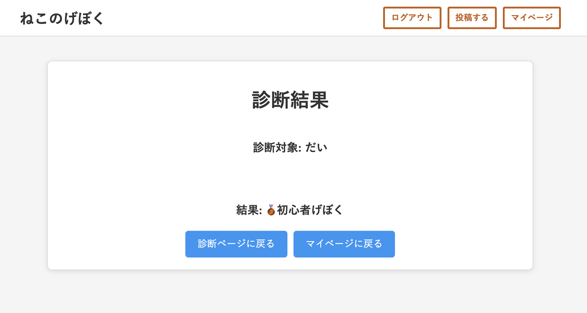
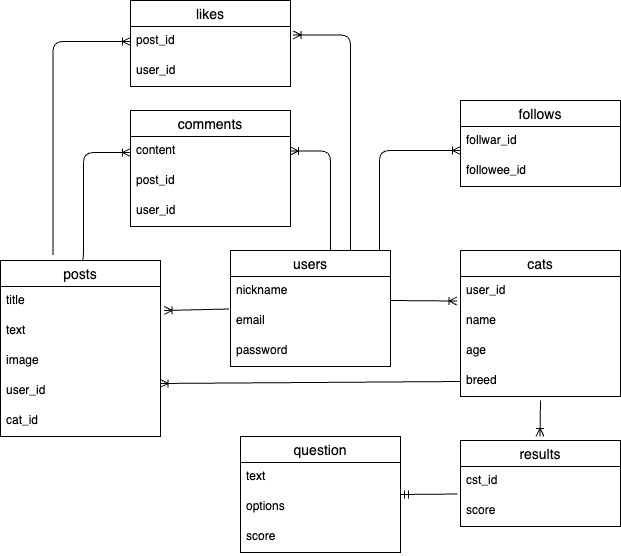

# README

# アプリケーション名	
ねこのげぼく診断アプリ
# アプリケーション概要  
猫好きな人向けの診断・投稿アプリ。  
猫ごとの「げぼく度診断」を楽しめる  
猫の情報を登録し、日常を共有できる。  
他のユーザーをフォローして、投稿に「いいね」やコメントが可能
# URL 	
デプロイ済みのURLを記載。デプロイが済んでいない場合は、デプロイが完了次第記載すること。
# テスト用アカウント 	
ログイン機能等を実装した場合は、ログインに必要な情報を記載。  
Basic認証
	ID: admin
	パスワード: 2222
# 利用方法	 
  トップページから新規登録またはログイン。  
  ・猫の情報を登録（名前、年齢、品種）。  
  ・猫の「げぼく度診断」を受ける。  
  ・診断結果をシェアしたり、ランキングを確認。  
  ・写真やメッセージを投稿して、他のユーザーと交流。
# アプリケーションを作成した背景　　
•	対象ユーザー: 猫好きな人、猫を飼っている人。  
•	解決したい課題: 猫との生活をより楽しくする仕掛けが少ない。  
•	背景: 猫好きな人同士が交流し、猫への愛情を深められるプラットフォームを提供したい。
# 機能1: ねこのげぼく度診断  
•	説明: 飼い猫ごとに質問に回答し、げぼく度をスコア化します。
	•	画像/GIF:
	•	診断機能のGIF 

機能2: 投稿機能
	•	説明: 猫の写真や日常を投稿し、他のユーザーと交流できます。
	•	画像/GIF:
	•	投稿機能の画像
# 実装予定の機能  
•	チャット機能（ユーザー同士でリアルタイム交流が可能）  
•	猫の成長記録のタイムライン機能  
•	通知機能（コメントやいいねの通知）
# データベース設計	

# 画面遷移図	  

# 開発環境  
•	言語: Ruby 3.2.2  
•	フレームワーク: Ruby on Rails 7.1.0  
•	データベース: MySQL  
•	インフラ: Heroku（例）  
•	ツール: GitHub、VSCode
# ローカルでの動作方法	  
git clone https://github.com/yourusername/neko_slave_app.git(例)
cd cat_app
bundle install
rails db:create
rails db:migrate
rails server
# 工夫したポイント  
•	制作背景: 猫好きな人が気軽に楽しめる診断や、投稿を通じた交流を目指した。  
•	技術的な工夫: 猫ごとの診断結果管理やランキング表示の効率化。  
•	開発手法: GitHubを用いたバージョン管理とチーム開発。
# 改善点  
•	UI/UX改善: デザインをより魅力的にする。  
•	パフォーマンス最適化: 投稿一覧の表示速度を改善する。  
•	国際化対応: 多言語対応でユーザー層を拡大。
# 制作時間	  
アプリケーションを制作するのにかけた時間。
  
  •	企画・設計: 2日  
  •	開発: 3週間 (例)   
  •	テスト・修正: 1週間(例)

## usersテーブル

| Column     | Type       | Options                        |
| ---------- | ---------- | ------------------------------ |
| user       | references | null: false, foreign_key: true |
| email      | string	    | null: false, unique: true      |
| password   | string	    | null: false                    |
| nickname   | string	    | null: false                    |
| created_at | datetime   |	null: false                    |
| updated_at | datetime   |	null: false                    |

### Association
- has_many :cats
- has_many :posts
- has_many :likes
- has_many :comments
- has_many :active_relationships, class_name: "Relationship", foreign_key: "follower_id", dependent: :destroy
- has_many :following, through: :active_relationships, source: :following

  # フォローされる側の関係
- has_many :passive_relationships, class_name: "Relationship", foreign_key: "following_id", dependent: :destroy
- has_many :followers, through: :passive_relationships, source: :follower

## postsテーブル

| Column     | Type       | Options                        |
| ---------- | ---------- | ------------------------------ |
| user_id    | references | null: false, foreign_key: true |
| cat_id     | references | null: false, foreign_key: true |
| title      | string	    | null: false                    |
| content    | text       | null: false                    |
| image      | string     | null: false                    |
| created_at | datetime   |	null: false                    |
| updated_at | datetime   |	null: false                    |

### Association
- belongs_to :user
- belongs_to :cat
- has_many :likes
- has_many :comments

## catsテーブル

| Column     | Type       | Options                        |
| ---------- | ---------- | ------------------------------ |
| user_id    | references | null: false, foreign_key: true |
| name       | string     | null: false                    |
| age        | integer    | null: false                    |
| breed      | string     | null: false                    |
| diagnosis_result | string |                              |
| created_at | datetime   |	null: false                    |
| updated_at | datetime   |	null: false                    |

### Association
- belongs_to :user
- has_many :posts
- has_many :results

## likesテーブル

| Column     | Type       | Options                        |
| ---------- | ---------- | ------------------------------ |
| user_id    | references | null: false, foreign_key: true |
| post_id    | references | null: false, foreign_key: true |
| created_at | datetime   |	null: false                    |
| updated_at | datetime   |	null: false                    |

### Association
- belongs_to :user
- belongs_to :post

## commentsテーブル

| Column     | Type       | Options                        |
| ---------- | ---------- | ------------------------------ |
| user_id    | references | null: false, foreign_key: true |
| post_id    | references | null: false, foreign_key: true |
| content    | text       | null: false                    |
| created_at | datetime   |	null: false                    |
| updated_at | datetime   |	null: false                    |

### Association
- belongs_to :user
- belongs_to :post

## relationshipsテーブル

| Column     | Type       | Options                        |
| ---------- | ---------- | ------------------------------ |
| follower_id| bigint     | null: false, foreign_key: true |
| following_id| bigint     | null: false, foreign_key: true |
| created_at | datetime   |	null: false                    |
| updated_at | datetime   |	null: false                    |

### Association
- belongs_to :follower, class_name: "User"
- belongs_to :following, class_name: "User"

## resultsテーブル

| Column     | Type       | Options                        |
| ---------- | ---------- | ------------------------------ |
| cat_id     | bigint     | null: false, foreign_key: true |
| total_score| integer    | null: false, foreign_key: true |
| created_at | datetime   |	null: false                    |
| updated_at | datetime   |	null: false                    |

### Association
- belongs_to :cat

## questionsテーブル

| Column     | Type       | Options                        |
| ---------- | ---------- | ------------------------------ |
| text	     | string     | null: false                    |
| options    | text       | null: false                    |
| score	     | integer    | null: false                    |
| created_at | datetime   |	null: false                    |
| updated_at | datetime   |	null: false                    |

### Association

## post_catsテーブル

| Column     | Type       | Options                        |
| ---------- | ---------- | ------------------------------ |
| cat_id    | references | null: false, foreign_key: true |
| post_id    | references | null: false, foreign_key: true |

### Association

-belongs_to :post
-belongs_to :cat