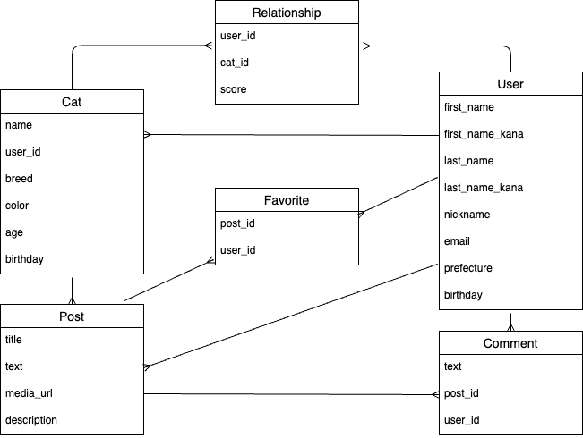

# README

# アプリケーション名
ねこのげぼく	
# アプリケーション概要
「ねこのげぼく」は、ユーザーが自分のねこの写真を共有し、他のユーザーと交流することができるソーシャルネットワークアプリです。このアプリを通じて、ユーザーはねことの関係性を深め、他のねこ好きのコミュニティとつながることができます。
## 主な機能
ユーザー管理: ユーザー登録、ログイン、プロフィール編集。
ねこの情報管理: ユーザーが所有するねこの情報登録。
写真動画投稿: 猫の写真や動画をアップロードし、共有できます
コメント投稿: 投稿された写真に対してコメントを残せます
写真動画お気に入り登録: 気に入った写真動画をお気に入りに追加します
フォロー機能: 他のユーザーをフォローし、フィードで最新の投稿を見れます
関係性診断: ユーザーとねことの関係性を診断します
# URL	デプロイ済みのURLを記載デプロイが済んでいない場合は、デプロイが完了次第記載すること。
# テスト用アカウント	ログイン機能等を実装した場合は、ログインに必要な情報を記載。またBasic認証等を設けている場合は、そのID/Passも記載すること。
# 利用方法	
アプリに登録し、自分のプロフィールと猫のプロフィールを作成します。
ねこの写真や動画を投稿し、他のユーザーと共有します。
他のユーザーの投稿に「いいね！」やコメントをして、コミュニケーションを楽しみます。
「げぼく度」診断機能を使って、ねことの関係性をチェックします。
# アプリケーションを作成した背景	
多くのねこの飼い主が、ねことの生活の中で得た喜びや困ったことを共有し、解決策を見つけたいと考えています。しかし、そのようなコミュニティを提供するアプリは意外と少ないため、猫愛好家が気軽に情報交換できるプラットフォームを提供したいと考えました。
# 実装した機能についての画像やGIFおよびその説明※	実装した機能について、それぞれどのような特徴があるのかを列挙する形で記載。画像はGyazoで、GIFはGyazoGIFで撮影すること。
# 実装予定の機能
猫の健康管理ログ機能
ユーザー間のプライベートメッセージ機能
猫カフェの情報共有機能
# データベース設計

# 画面遷移図	

# 開発環境
フロントエンド
バックエンド: Ruby on Rails
データベース: PostgreSQL
ストレージ: 
開発ツール: GitHub
# ローカルでの動作方法	git cloneしてから、ローカルで動作をさせるまでに必要なコマンドを記載。
# 工夫したポイント
ユーザーフレンドリーなUI/UXデザインを心がけ、ねこの写真や動画を前面に出した視覚的に魅力的なインターフェイスを実現しました。
ねことの関係性を診断する「げぼく度」診断機能を導入し、ユーザーに新しい楽しみ方を提供しました。
Agile開発方法論を採用し、迅速なフィードバックループを通じて、ユーザーのニーズに合わせた機能改善を行いました。
# 改善点
AIを用いた猫の表情解析機能を導入し、猫の気持ちをより深く理解できる機能を開発する。
コミュニティ機能を強化し、ユーザーがより活発に交流できる環境を提供する。
# 制作時間	アプリケーションを制作するのにかけた時間。

## Usersテーブル

| Column             | Type	     | Options                            |
| ------------------ | --------- | ---------------------------------- |
| userID	           | INTEGER	 | PRIMARY KEY                        |
| email              | string    | null: false, unique: true          |
| last_name          | string    | null: false                        |
| first_name         | string    | null: false                        |
| last_name_kana     | string    | null: false                        |
| first_name_kana    | string    | null: false                        |
| nickname           | string    | null: false                        |
| prefecture_id      | integer   | null: false                        |
| encrypted_password | string    | null: false                        |
| birthday           | date	     | null: false                        |

### association

has_many :cats
has_many :posts
has_many :favorites
has_many :favorite_posts
has_many :followed_users
has_many :following, through: :followed_users
has-many :followers, through: :following_users
has_many :relationships

## Cats テーブル

| Column             | Type       |	Options                           |
| ------------------ | ---------- | --------------------------------- |
| catID	             | INTEGER    | PRIMARY KEY                       |
| ownerUserID	       | INTEGER	  | null: false, FOREIGN KEY (Users)  |
| name	             | string     |	null: false                       |
| age_id             | integer    | null: false                       |
| birthday           | date	      | null: false                       |	
| breed_id           | integer    |	null: false                       |
| color_id           | integer    | null: false                       |

### association
belongs_to :owner
has_many :posts

## Posts テーブル

| Column             | Type       |	Options                           |
| ------------------ | ---------- | --------------------------------- |
| postID             | INTEGER    | PRIMARY KEY                       |
| userID             | INTEGER	  | null: false, FOREIGN KEY (Users)  |
| catID              | INTEGER    | null: false, FOREIGN KEY (Cats)   |
| title	             | string     | null: false                       |
| text	             | text       | null: false                       |
| media_url	         | string	    | null: false                       |
| media_type	       | string     | null: false                       |
| description        | TEXT	      |                                   |
| sharedWith         | string     | null: false                       |

### association
belongs_to :user
belongs_to :cat
has_many :comments

## Comments テーブル

| Column              | Type       |	Options                           |
| ------------------- | ---------- | ---------------------------------- |
| commentID	          | INTEGER	   | PRIMARY KEY,                       |
| postID              | INTEGER	   | NOT NULL, FOREIGN KEY (Posts)      |
| userID	            | INTEGER	   | NOT NULL, FOREIGN KEY (Users)      |
| text	              | TEXT       | NOT NULL                           |

### association
belongs_to :user
belongs_to :post

## Follows テーブル

| Column              | Type       | Options                            |
| ------------------- | ---------- | ---------------------------------- |
| followID            | INTEGER    | PRIMARY KEY                        |
| followerUserID      | INTEGER    | NOT NULL, FOREIGN KEY (Users)      |
| followedUserID      | INTEGER	   | NOT NULL, FOREIGN KEY (Users)      |

### association
belongs_to :follower
belongs_to :followed
has_many :followed_users,through: :following_users

## Favorites テーブル

| Column	            | Type       | Options                            |
| ------------------- | ---------- | ---------------------------------- |
| favoriteID          | INTEGER	   | PRIMARY KEY                        |
| userID              | INTEGER	   | NOT NULL, FOREIGN KEY (Users)      |
| postID              | INTEGER    | NOT NULL, FOREIGN KEY (Posts)      |

### association
belongs_to :user
belongs_to :photo

## Relationships テーブル

| Column              | Type       | Options                            |
| ------------------- | ---------- | ---------------------------------- |
| relationshipID      | INTEGER    | PRIMARY KEY,                       |
| userID              | INTEGER    | NOT NULL, FOREIGN KEY (Users)      |
| catID               | INTEGER    | NOT NULL, FOREIGN KEY (Cats)       |
| score               | INTEGER    | 	                                  |
| category            |            | 	                                  |

### association
belongs_to :user
belongs_to :cat

This README would normally document whatever steps are necessary to get the
application up and running.

Things you may want to cover:

* Ruby version

* System dependencies

* Configuration

* Database creation

* Database initialization

* How to run the test suite

* Services (job queues, cache servers, search engines, etc.)

* Deployment instructions

* ...
